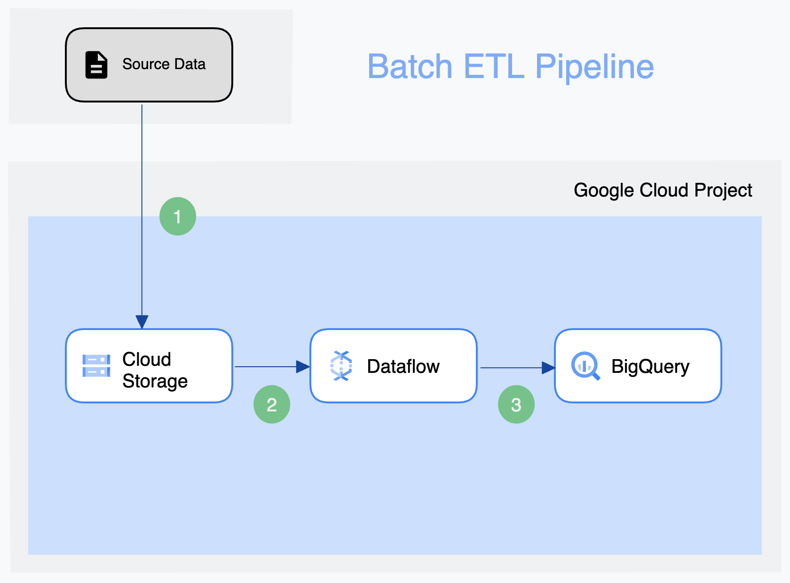
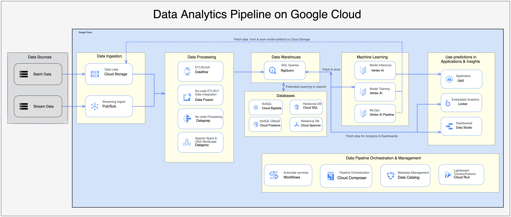

# DataScientest NY News - Feed

> Repo d'un use case du projet centré sur l'API Times Wire du NY Times

## Objectifs

### 1. Data Analytics

- Construire un pipeline ETL 
  - capable de traiter par batch des données 
  - extraites de l'API Times Wire
    - vers une solution de stockage des données bruts
  - transfomées pour être utilisable dans notre cas d'usage
  - renvoyées vers une base de données
    - répondant aux besoins analytiques et/ou applicatifs du cas d'usage

### 2. Web Dev

- Construire une application démontrant l'utilisabilité des données affinées
  - avec un back-end pour manipuler ces données
  - et un front-end pour afficher le résultat et/ou interagir avec les données 

### 3. DataOps

- Améliorer itérativement le workflow du projet
  - avec une solution d'orchestration du pipeline ETL (-> Airflow)
  - en transférant le projet dans une solution cloud (-> GCP)
  - en renforçant l'architecture micro-services en containersiant chaque composant du projet (-> Docker/Kubernetes)
  - en adoptant une architecture IaC pour déployer le projet (-> Terraform)

## Architecture

Exemples d'architecture visé (si on atteint l'étape d'implantation dans GCP):

  

  

## Structure du projet

Les éléments principaux de ce repo sont organisés par logique fonctionnelle:

  - Data Pipeline:
    - `extract`
    - `transform`
    - `load`
  - Web App:
    - `backend`
    - `frontend`
  - DataOps:
    - `orchestration`

## Pour démarrer le projet

- clonez ce repo
- installez les librairies Python requises en lançant cette commande dans votre terminal:

  ```shell
  pip install -r requirements-dev.txt 
  ```
